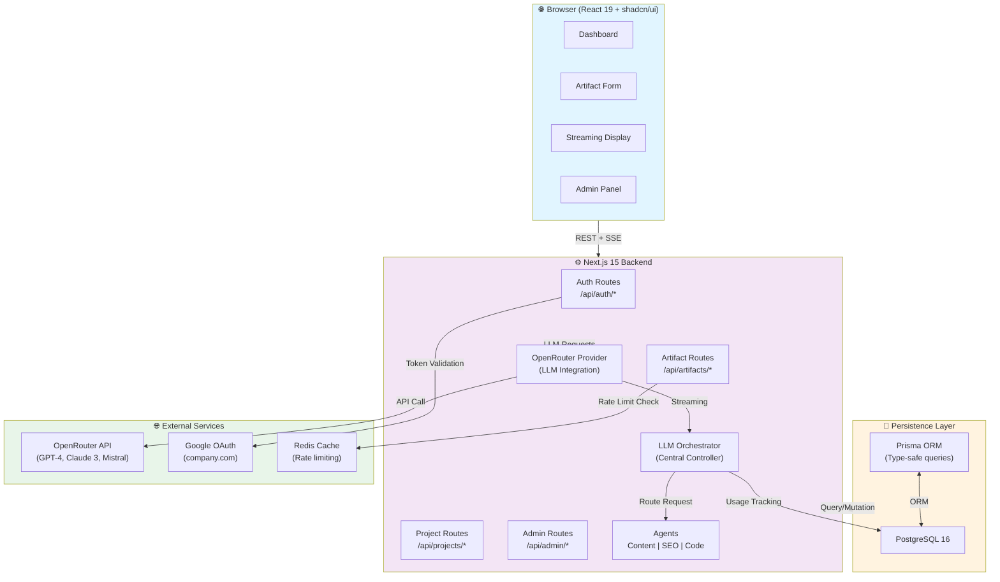
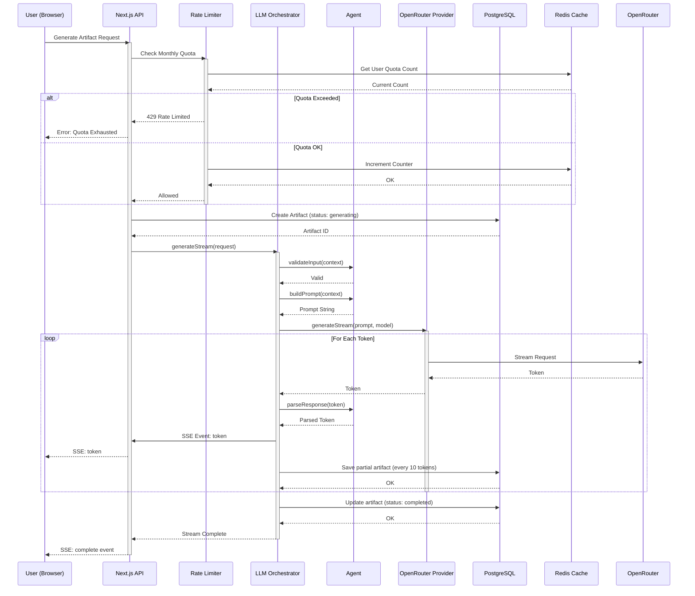
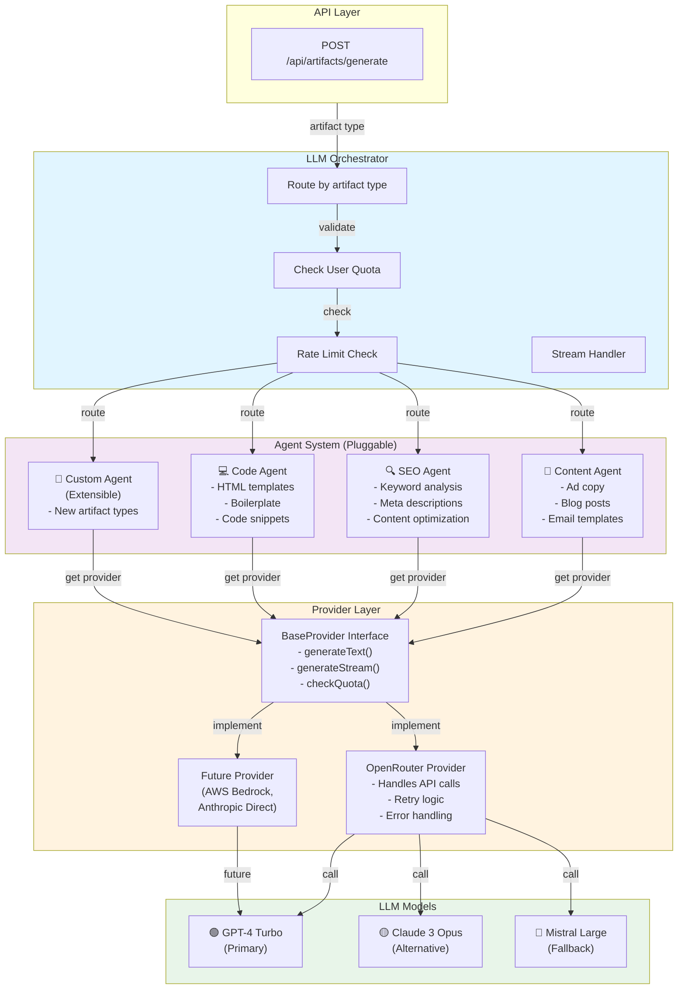
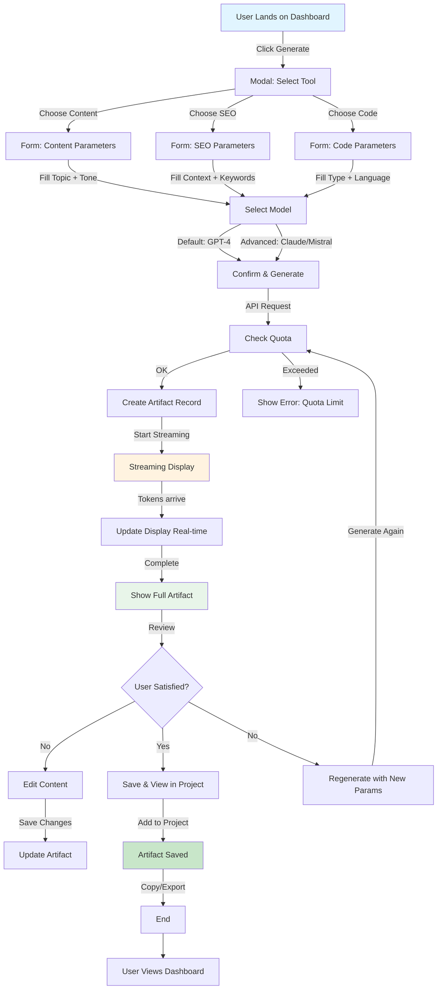
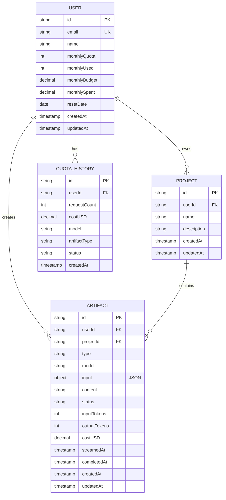
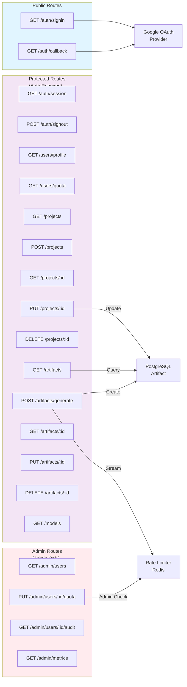
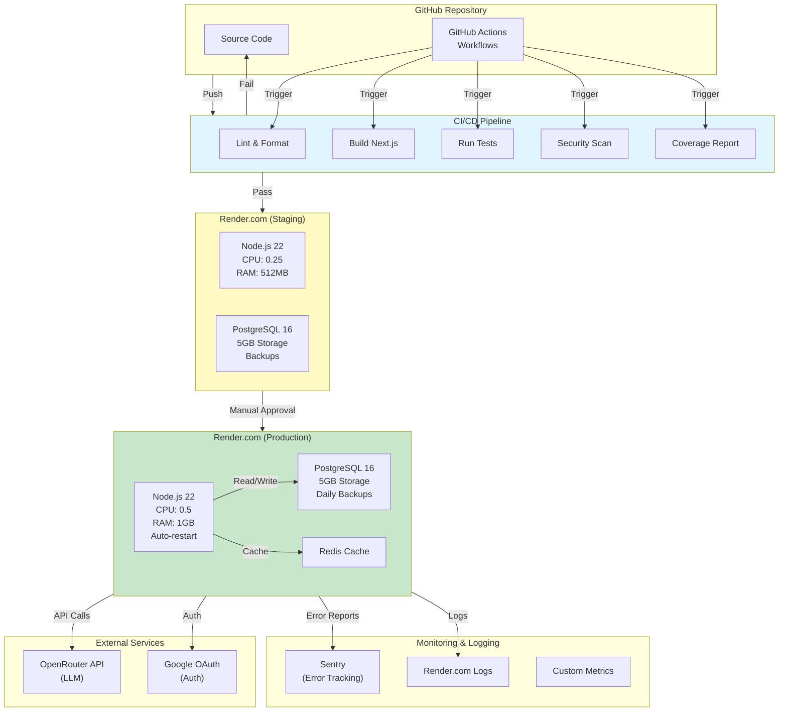
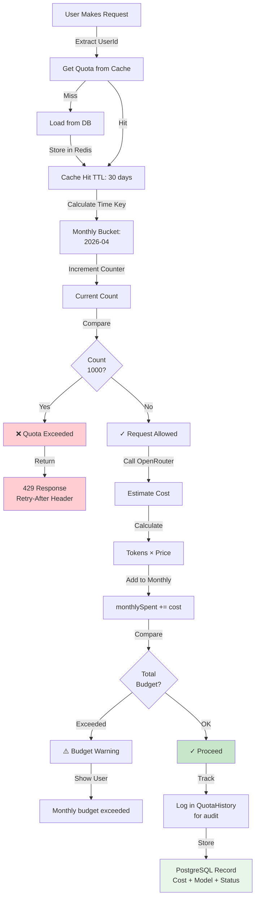
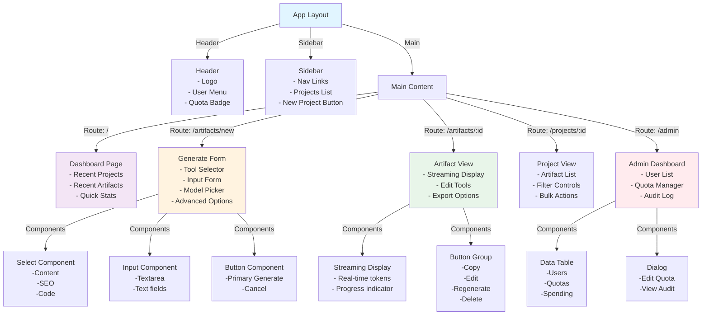
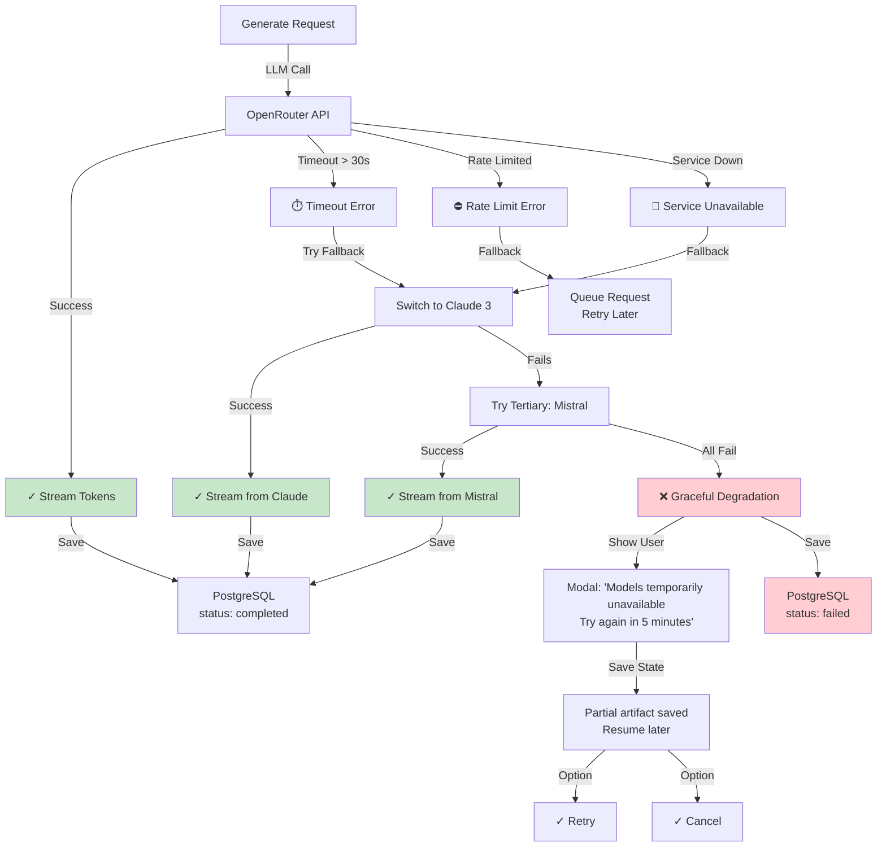

# Architecture Diagrams: LLM Artifact Generation Hub

**Version**: 1.0  
**Status**: REFERENCE FOR UNDERSTANDING SYSTEM DESIGN  
**Format**: Mermaid.js diagrams  
**Last Updated**: 2026-04-07

---

## 1. System Architecture Overview



---

## 2. Data Flow: Artifact Generation



---

## 3. LLM Module Architecture



---

## 4. User Journey: Generate Artifact



---

## 5. Database Schema Relationships



---

## 6. API Routes & Dependencies



---

## 7. Deployment Architecture (Render.com)



---

## 8. Streaming Data Flow (Real-time)

```mermaid
graph LR
    subgraph Client["Browser Client<br/>(React Hook)"]
        EventSource["EventSource<br/>Connection"]
        TokenBuffer["Token Buffer"]
        Display["DOM Update"]
    end
    
    subgraph Server["Next.js Server<br/>(SSE)"]
        Route["POST /api/artifacts/generate"]
        Stream["Stream Generator"]
    end
    
    subgraph LLM["OpenRouter<br/>(Streaming)"]
        Connection["Server Connection"]
        TokenStream["Token Stream"]
    end
    
    subgraph DB["Database<br/>(Periodic Save)"]
        SaveQueue["Save Queue<br/>Every 10 tokens"]
        PostgreSQL["PostgreSQL"]
    end
    
    EventSource -->|Connect| Route
    Route -->|Start Stream| Connection
    
    Connection -->|Open| Stream
    Stream -->|Subscribe| TokenStream
    
    loop Every Token
        TokenStream -->|Token| Stream
        Stream -->|SSE Event| EventSource
        EventSource -->|Parse JSON| TokenBuffer
        TokenBuffer -->|Update| Display
        
        Stream -->|Buffer| SaveQueue
        SaveQueue -->|Batch Save| PostgreSQL
    end
    
    TokenStream -->|EOF| Stream
    Stream -->|Complete Event| EventSource
    EventSource -->|Close| Route
    
    style Client fill:#e1f5ff
    style Server fill:#f3e5f5
    style LLM fill:#fff3e0
    style DB fill:#e8f5e9
```

---

## 9. Authentication & Session Flow

```mermaid
graph TD
    A["User Visits App"] -->|No Session| B["Redirect to Sign In"]
    B -->|Click Login| C["Google OAuth Login"]
    C -->|Approve| D["Google Callback"]
    D -->|Email Check| E{Email<br/>@company.com?}
    
    E -->|No| F["❌ Access Denied"]
    E -->|Yes| G["✓ Create Session"]
    
    G -->|JWT Token| H["Store in Database"]
    H -->|Cookie| I["Set Secure Cookie"]
    
    I -->|Redirect| J["Dashboard"]
    J -->|User Logged In| K["Can Access Protected Routes"]
    
    K -->|Each Request| L["Validate Session<br/>middleware"]
    L -->|Valid| M["Grant Access"]
    L -->|Invalid/Expired| N["Redirect to Login"]
    
    J -->|Click Sign Out| O["Clear Session"]
    O -->|Delete JWT| P["Clear Cookie"]
    P -->|Redirect| B
    
    style F fill:#ffcdd2
    style M fill:#c8e6c9
    style J fill:#e1f5ff
```

---

## 10. Rate Limiting & Quota Strategy



---

## 11. Component Hierarchy (shadcn/ui)



---

## 12. Error Handling & Fallback Strategy



---

Questi diagrammi coprono:
- ✅ System architecture overview
- ✅ Data flow end-to-end
- ✅ LLM module structure
- ✅ User journeys
- ✅ Database relationships
- ✅ API routes
- ✅ Deployment pipeline
- ✅ Streaming details
- ✅ Authentication
- ✅ Rate limiting
- ✅ Component hierarchy
- ✅ Error handling

**Tip**: Renderizza questi diagrammi con [Mermaid Live Editor](https://mermaid.live/) per visualizzazione interattiva!
