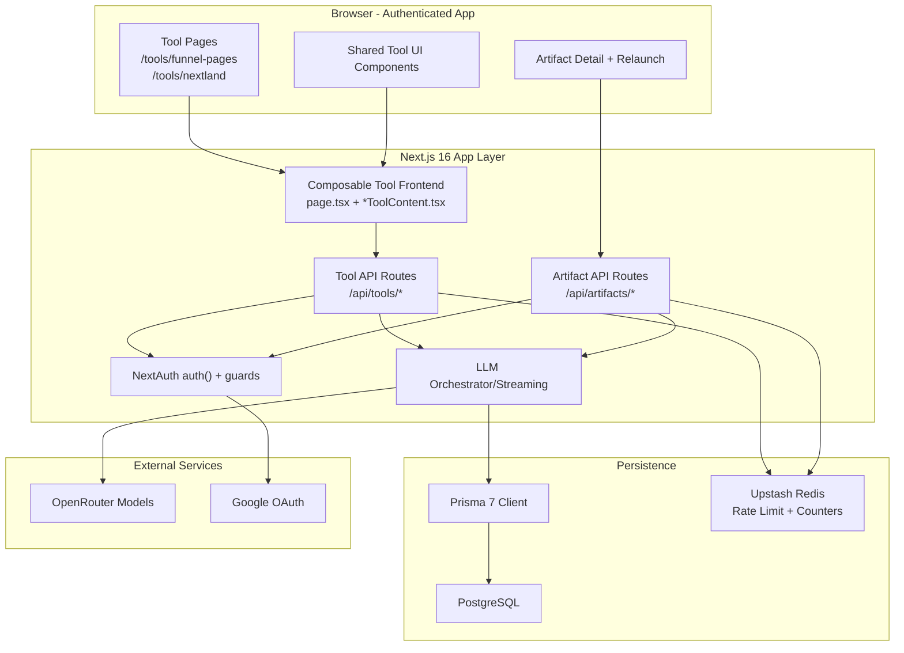
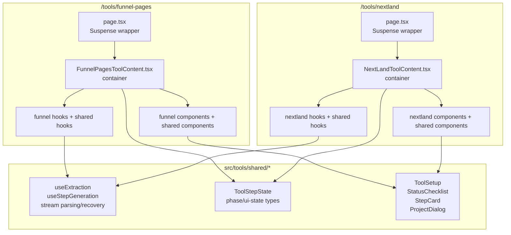
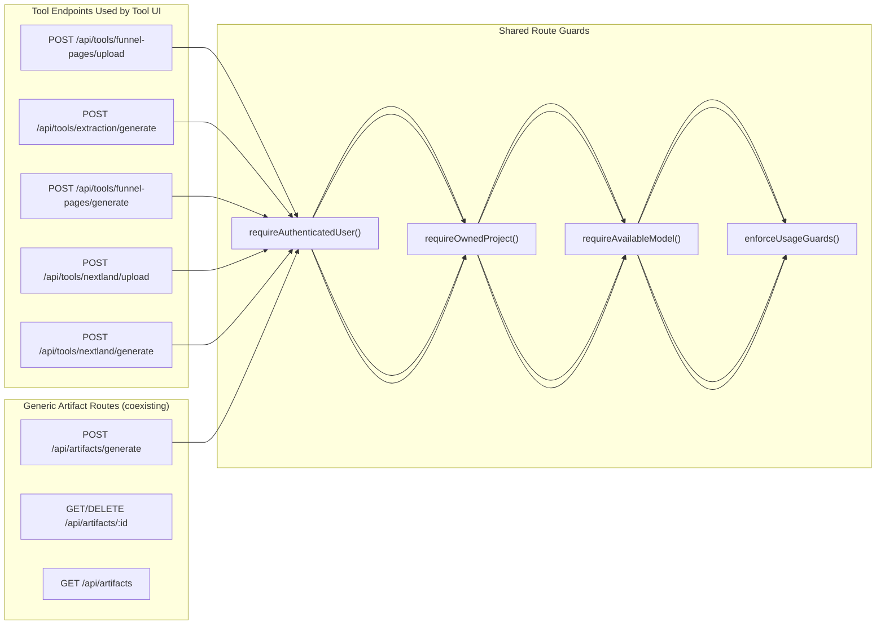
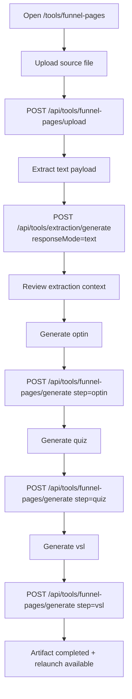
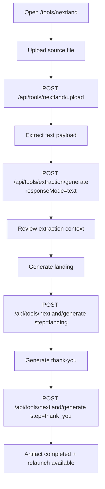
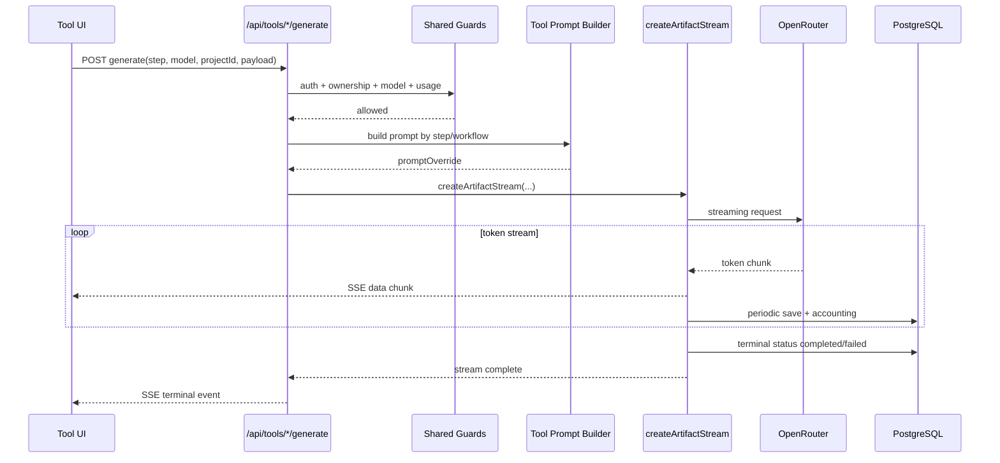
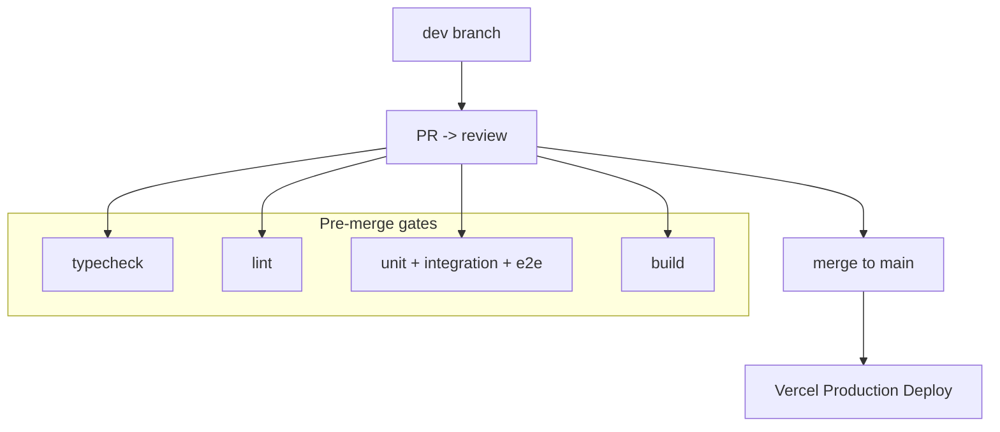
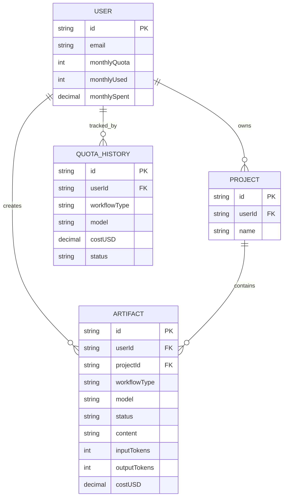

# Architecture Diagrams: Tool Scope As-Is (HotLeadFunnel, NextLand)

**Version**: 2.0  
**Status**: AS-IS (operativo)  
**Format**: Mermaid.js diagrams  
**Last Updated**: 2026-04-18

Questo documento rappresenta lo stato as-is corrente per il perimetro tool standard attivo:
- HotLeadFunnel (`/tools/funnel-pages`)
- NextLand (`/tools/nextland`)

Riferimenti canonici:
- [docs/adrs/004-tool-pages-composable-architecture.md](../adrs/004-tool-pages-composable-architecture.md)
- [docs/implement-index.md](../implement-index.md)
- [docs/specifications/api-specifications.md](../specifications/api-specifications.md)

Nota perimetro:
- `meta-ads` rimane route legacy (`/api/tools/meta-ads/generate`) fuori dallo scope tool standard di questi diagrammi.
- La route `POST /api/artifacts/generate` coesiste come entrypoint generico, ma i flussi tool UI qui descritti usano endpoint `/api/tools/*`.

---

## 1. System Overview (Tool Scope)

---

## 2. Frontend Composable Architecture

---

## 3. Route Topology (As-Is)

---

## 4. User Journey: HotLeadFunnel (Upload-First)

---

## 5. User Journey: NextLand (2-Step)

---

## 6. Step Generation Sequence (Tool Route)

---

## 7. Deployment and Branch Flow (As Operated)

---

## 8. Data Model Focus (Tool Generation)

---

Copertura di questi diagrammi:
- Architettura runtime per tool standard attivi
- Pattern frontend composable (ADR 004)
- Route topology reale per upload/extraction/generation
- User journey separati HotLeadFunnel e NextLand
- Sequenza streaming con guard condivisi
- Flow di deploy coerente con branch policy operativa
